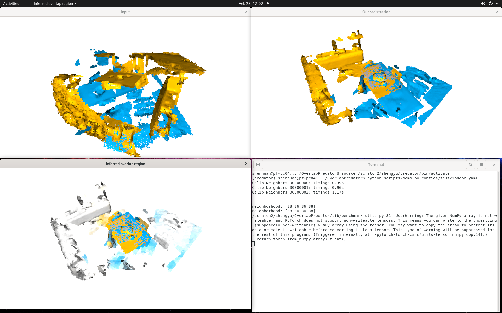

## PREDATOR: Registration of 3D Point Clouds with Low Overlap (CVPR 2021, Oral)
This repository represents the official implementation of the paper:

### [PREDATOR: Registration of 3D Point Clouds with Low Overlap](https://arxiv.org/abs/2011.13005)

\*[Shengyu Huang](https://shengyuh.github.io), \*[Zan Gojcic](https://zgojcic.github.io/), [Mikhail Usvyatsov](https://aelphy.github.io), [Andreas Wieser](https://gseg.igp.ethz.ch/people/group-head/prof-dr--andreas-wieser.html), [Konrad Schindler](https://prs.igp.ethz.ch/group/people/person-detail.schindler.html)\
|[ETH Zurich](https://igp.ethz.ch/) | \* Equal contribution

For implementation using MinkowskiEngine backbone, please check [this](https://github.com/ShengyuH/OverlapPredator.Mink)

For more information, please see the [project website](https://overlappredator.github.io)


### Contact
If you have any questions, please let us know: 
- Shengyu Huang {shengyu.huang@geod.baug.ethz.ch}
- Zan Gojcic {zan.gojcic@geod.baug.ethz.ch}

## News
- 2021-08-09: We've updated arxiv version of our [paper](https://arxiv.org/abs/2011.13005) with improved performance!
- 2021-06-02: Fix feature gathering bug in k-nn graph, please see improved performance in this [issue](https://github.com/overlappredator/OverlapPredator/issues/15). Stay tunned for updates on other experiments!
- 2021-05-31: Check our video and poster on [project page](https://overlappredator.github.io)! 
- 2021-03-25: Camera ready is on arXiv! I also gave a talk on Predator(中文), you can find the recording here: [Bilibili](https://www.bilibili.com/video/BV1UK4y1U7Gs), [Youtube](https://www.youtube.com/watch?v=AZQGJa6R_4I&t=1563s) 
- 2021-02-28: MinkowskiEngine-based PREDATOR [release](https://github.com/ShengyuH/OverlapPredator.Mink.git)
- 2020-11-30: Code and paper release


## Instructions
This code has been tested on 
- Python 3.8.5, PyTorch 1.7.1, CUDA 11.2, gcc 9.3.0, GeForce RTX 3090/GeForce GTX 1080Ti

**Note**: We observe random data loader crashes due to memory issues, if you observe similar issues, please consider reducing the number of workers or increasing CPU RAM. We now released a sparse convolution-based Predator, have a look [here](https://github.com/ShengyuH/OverlapPredator.Mink.git)!

### Requirements
To create a virtual environment and install the required dependences please run:
```shell
git clone https://github.com/overlappredator/OverlapPredator.git
virtualenv predator; source predator/bin/activate
cd OverlapPredator; pip install -r requirements.txt
cd cpp_wrappers; sh compile_wrappers.sh; cd ..
```
in your working folder.

### Datasets and pretrained models
For KITTI dataset, please follow the instruction on [KITTI Odometry website](http://www.cvlibs.net/datasets/kitti/eval_odometry.php) to download the KITTI odometry training set.

We provide 
- preprocessed 3DMatch pairwise datasets (voxel-grid subsampled fragments together with their ground truth transformation matrices)
- raw dense 3DMatch datasets
- modelnet dataset
- pretrained models on 3DMatch, KITTI and Modelnet

The preprocessed data and models can be downloaded by running:
```shell
sh scripts/download_data_weight.sh
```

To download raw dense 3DMatch data, please run:
```shell
wget --no-check-certificate --show-progress https://share.phys.ethz.ch/~gsg/pairwise_reg/3dmatch.zip
unzip 3dmatch.zip
```

The folder is organised as follows:

- `3dmatch`
    - `train`
        - `7-scenes-chess`
            - `fragments`
                - `cloud_bin_*.ply`
                - ...
            - `poses`
                - `cloud_bin_*.txt`
                - ...
        - ...
    - `test`

### 3DMatch(Indoor)
#### Train
After creating the virtual environment and downloading the datasets, Predator can be trained using:
```shell
python main.py configs/train/indoor.yaml
```

#### Evaluate
For 3DMatch, to reproduce Table 2 in our main paper, we first extract features and overlap/matachability scores by running: 
```shell
python main.py configs/test/indoor.yaml
```
the features together with scores will be saved to ```snapshot/indoor/3DMatch```. The estimation of the transformation parameters using RANSAC can then be carried out using:
```shell
for N_POINTS in 250 500 1000 2500 5000
do
  python scripts/evaluate_predator.py --source_path snapshot/indoor/3DMatch --n_points $N_POINTS --benchmark 3DMatch --exp_dir snapshot/indoor/est_traj --sampling prob
done
```
dependent on ```n_points``` used by RANSAC, this might take a few minutes. The final results are stored in ```snapshot/indoor/est_traj/{benchmark}_{n_points}_prob/result```. To evaluate PREDATOR on 3DLoMatch benchmark, please also change ```3DMatch``` to ```3DLoMatch``` in ```configs/test/indoor.yaml```.

#### Demo
We prepared a small demo, which demonstrates the whole Predator pipeline using two random fragments from the 3DMatch dataset. To carry out the demo, please run:
```shell
python scripts/demo.py configs/test/indoor.yaml
```

The demo script will visualize input point clouds, inferred overlap regions, and point cloud aligned with the estimated transformation parameters:



### ModelNet(Synthetic)
#### Train
To train PREDATOR on ModelNet, please run:
```
python main.py configs/train/modelnet.yaml
```

We provide a small script to evaluate Predator on ModelNet test set, please run:
```
python main.py configs/test/modelnet.yaml
```
The rotation and translation errors could be better/worse than the reported ones due to randomness in RANSAC. 

### KITTI(Outdoor)
We provide a small script to evaluate Predator on KITTI test set, after configuring KITTI dataset, please run:
```
python main.py configs/test/kitti.yaml
```
the results will be saved to the log file.


### Custom dataset
We have a few tips for train/test on custom dataset

- If it's similar indoor scenes, please run ```demo.py``` first to check the generalisation ability before retraining
- Remember to voxel-downsample the data in your data loader, see ```kitti.py``` for reference 

### Citation
If you find this code useful for your work or use it in your project, please consider citing:

```shell
@InProceedings{Huang_2021_CVPR,
    author    = {Huang, Shengyu and Gojcic, Zan and Usvyatsov, Mikhail and Wieser, Andreas and Schindler, Konrad},
    title     = {Predator: Registration of 3D Point Clouds With Low Overlap},
    booktitle = {Proceedings of the IEEE/CVF Conference on Computer Vision and Pattern Recognition (CVPR)},
    month     = {June},
    year      = {2021},
    pages     = {4267-4276}
}
```

### Acknowledgments
In this project we use (parts of) the official implementations of the followin works: 

- [FCGF](https://github.com/chrischoy/FCGF) (KITTI preprocessing)
- [D3Feat](https://github.com/XuyangBai/D3Feat.pytorch) (KPConv backbone)
- [3DSmoothNet](https://github.com/zgojcic/3DSmoothNet) (3DMatch preparation)
- [MultiviewReg](https://github.com/zgojcic/3D_multiview_reg) (3DMatch benchmark)
- [SuperGlue](https://github.com/magicleap/SuperGluePretrainedNetwork) (Transformer part)
- [DGCNN](https://github.com/WangYueFt/dgcnn) (self-gnn)
- [RPMNet](https://github.com/yewzijian/RPMNet) (ModelNet preprocessing and evaluation)

 We thank the respective authors for open sourcing their methods. We would also like to thank reviewers, especially reviewer 2 for his/her valuable inputs. 
