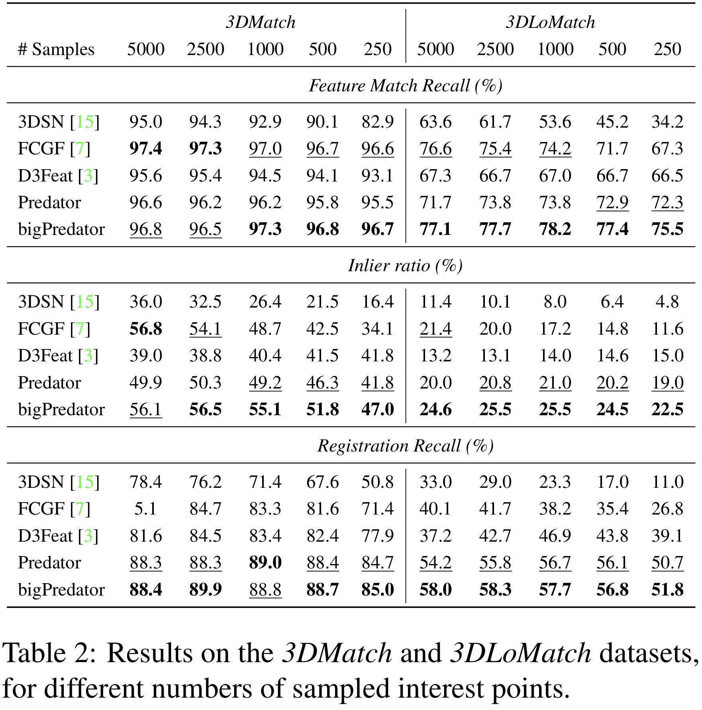

# PREDATOR: Registration of 3D Point Clouds with Low Overlap
This repository provides code and data required to train and evaluate PREDATOR, a  model  for  **p**airwise point-cloud **re**gistration with **d**eep **at**tention to the **o**verlap **r**egion. It represents the official implementation of the paper:

### [PREDATOR: Registration of 3D Point Clouds with Low Overlap](https://arxiv.org/abs/2011.13005)

\*[Shengyu Huang](https://shengyuh.github.io)
, \*[Zan Gojcic](https://zgojcic.github.io/)
, [Mikhail Usvyatsov](https://aelphy.github.io)
, [Andreas Wieser](https://gseg.igp.ethz.ch/people/group-head/prof-dr--andreas-wieser.html)
, [Konrad Schindler](https://prs.igp.ethz.ch/group/people/person-detail.schindler.html)\
|[ETH Zurich](https://igp.ethz.ch/) |\
\* Equal contribution


### Citation

If you find this code useful for your work or use it in your project, please consider citing:

```shell
@article{huang2020predator,
  title={PREDATOR: Registration of 3D Point Clouds with Low Overlap},
  author={Shengyu Huang, Zan Gojcic, Mikhail Usvyatsov, Andreas Wieser, Konrad Schindler},
  journal={arXiv:2011.13005 [cs.CV]},
  year={2020}
}
```

### Contact
If you have any questions, please let us know: Shengyu Huang {shengyu.huang@geod.baug.ethz.ch}

## News
- 2020-11-30: Code and paper release

## Instructions
This code has been tested on 
- Python 3.6.9/3.7.4, PyTorch 1.4.0/1.5.1, CUDA 10.1/11.0, gcc 6.3/7.5, TITAN Xp/GeForce RTX 2080 Ti/GeForce GTX 1080Ti
- Python 3.8.5, PyTorch 1.8.0.dev20201124+cu110, CUDA 11.1, gcc 9.3.0, GeForce RTX 3090

**Note**: We observe data loader random crash due to memory issues on machines with less than 64GB CPU RAM, please consider reduce the number of workers when having such problems. 

### Requirements
Under your working folder, our virtual environment and requirements can be installed by running:
```shell
git clone https://github.com/ShengyuH/OverlapPredator.git
virtualenv --no-site-packages predator -p python3; source predator/bin/activate
cd OverlapPredator; pip install -r requirements.txt
cd cpp_wrappers; sh compile_wrappers.sh; cd ..
```

### Datasets and pretrained models
We provide preprocessed 3DMatch pairwise datasets(fragments together with ground truth transformation matrix), and two pretrained models on 3DMatch dataset. bigPredator is a wider network which is trained on a single GeForce RTX 3090. You can download data and models by running:
```shell
sh download_data_weight.sh
```

| Model       | first_feats_dim   | gnn_feats_dim | # parameters|
|:-----------:|:-------------------:|:-------:|:-------:|
| Predator | 128               | 256 | 7.43M|
| bigPredator | 256                | 512 | 29.67M|





### Train
After having virtual environment and datasets prepared, you can train from scratch by running:
```shell
python main.py --mode train --exp_dir predator_3dmatch --first_feats_dim 128 --gnn_feats_dim 256
```
or 
```shell
python main.py --mode train --exp_dir bigpredator_3dmatch --first_feats_dim 256 --gnn_feats_dim 512
```

### Evaluate
To evaluate PREDATOR, we first extract features and scores on 3DLoMatch/3DMatch benchmark: 
```shell
python main.py --mode test --exp_dir predator_3dmatch --pretrain weights/Predator.pth --first_feats_dim 128 --gnn_feats_dim 256 --test_info 3DLoMatch
```
the features will be saved to ```snapshot/{exp_dir}/3DLoMatch```. Then we can run RANSAC by:
```shell
python evaluate_predator.py --source_path snapshot/predator_3dmatch/3DLoMatch --n_points 1000 --benchmark 3DLoMatch --exp_dir est_3dlomatch_1000
```
this might take a few minutes, depends on ```n_points``` used by RANSAC. The final results are stored in ```est_3dlomatch_1000/result```. To evaluate on 3DMatch benchmark, you can simply replace 3DLoMatch by 3DMatch.

### 
### Demo
TODO


